# Install Archcraft With Calamares Installer on UEFI/BIOS (With Encryption)

This is a simple guide for beginners and linux newbies to install Archcraft on their system, without messing it up.
Follow the steps below to install Archcraft with Calamares Installer on UEFI or BIOS system (with optional encryption).

I'm assuming that you have already created a [bootable USB](../boot/usb) with Archcraft ISO, boot system with it and
select **Boot Archcraft**. On the login screen, enter `liveuser` as the password & login to openbox desktop.
Press Window or Alt + F1 key to open launcher, select **Install Archcraft** and launch installer.

- You must be on the welcome screen of Archcraft installer now, Select the Installer language & click on Next

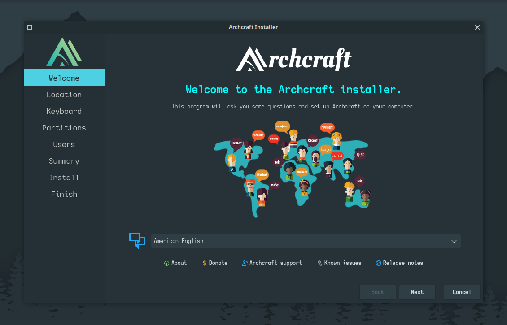

- On the next screen, select your Region and Time Zone. Installer will do that automatically if you are connected to the internet.

Here's an important thing to be mentioned, make sure you use an UTF-8 System Language or you'll face issues with some programs like (compton, plank, etc). Some programs are not able to detect the windows class and instances with Non UTF-8 system languages.

To check if your selected language is in UTF-8 or not, click on the Change... button at bottom right corner.

As you can see, The Indian English, en_IN is not in UTF-8 format. So I'm going to use en_US.UTF-8 as the System language.

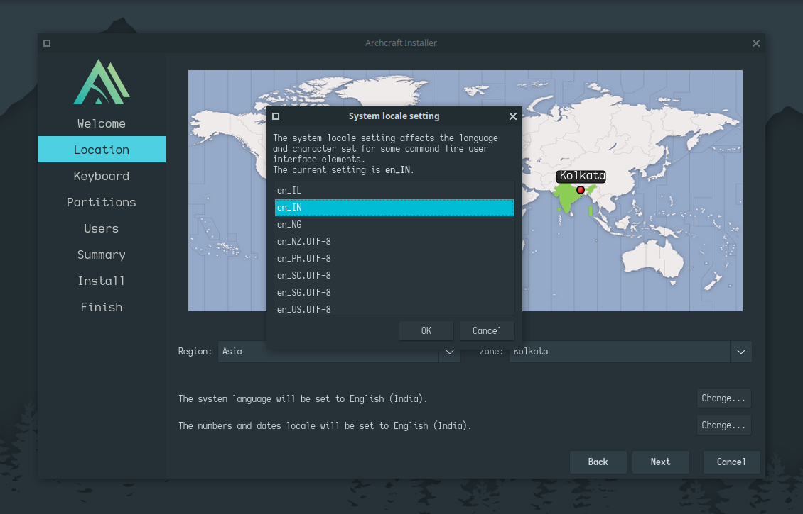

Now my system language is set to American English, which is in UTF-8 format. Choose accordingly and click on Next to continue.

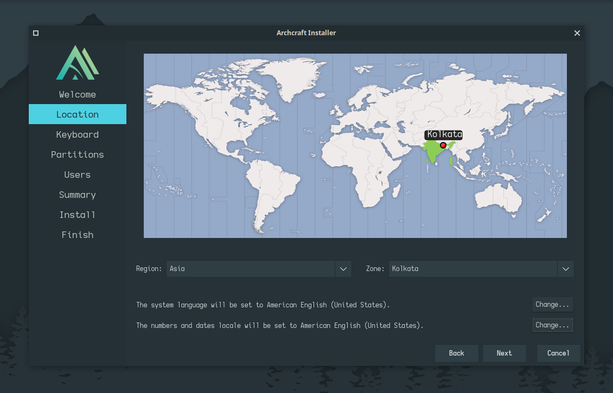

- On the next screen, select your Keyboard Layout and click on Next. By default it is automatically set as your system language.

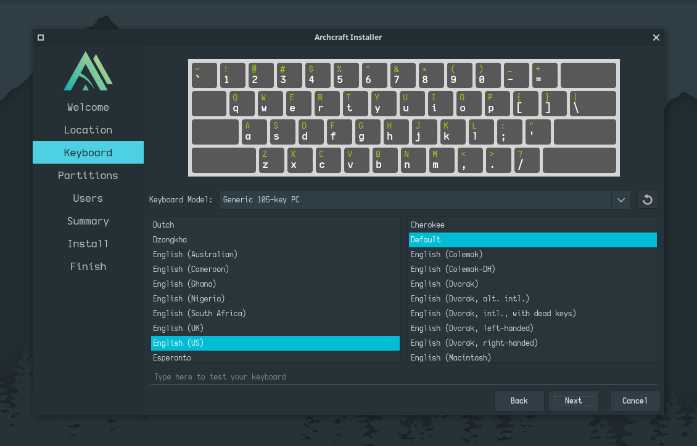

- Now, It's time to Partition the disk. This is where almost every Linux newbie messes things up. Be careful what you do here.

If you're installing on Virtualbox or any other virtual machine, you can simply choose Erase disk.
Or If you're trying to dual boot Archcraft with Windows, You can choose Alongside Windows. It's up to you, how you manage partitioning for your installation.

In this guide, I'm going to install Archcraft on UEFI with Encrypted root partition. I prefer to partition manually, So i'm selecting Manual Partitioning and moving forward.

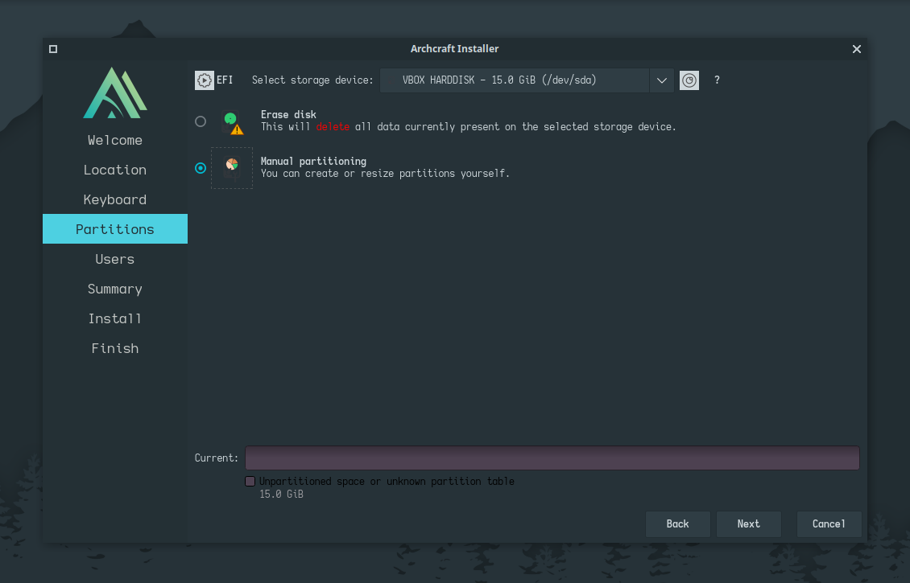

On the next screen, Click on New Partition Table. This is an empty disk as I'm installing Archcraft on Virtualbox.

Select GUID Partition Table (GPT) If you're booted in UEFI mode. For BIOS, choose Master Boot Record (MBR). You can use GPT for BIOS too, But in that case you have to set up a separate BIOS Boot Partition, Or grub will be fail to install.

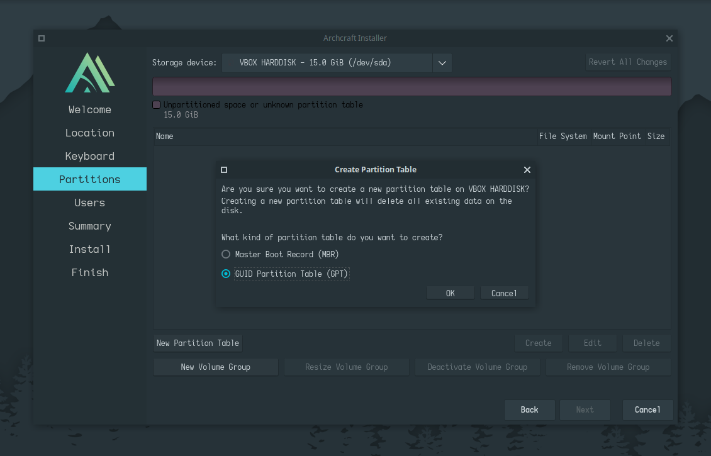

Partition table is created, Now click on Create to create partitions...

Let's make an EFI boot partition.
If you are dual booting Archcraft with Windows or Linux, There should already be an EFI boot partition on your disk.
In that case, you don't need to create a new one. Just mount the existing EFI partition at /boot/efi. Do not format it, otherwise, you won't be able to boot into Windows. 
If you are installing Archcraft with encryption on BIOS, you need to create a separate boot partition as well. 

Here, I've created a 300MB partition for EFI (and for encryption also) and mounted it at /boot/efi with a boot flag.

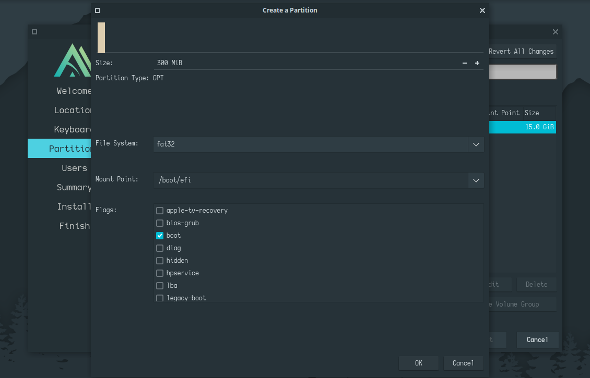

Next, I've created a 13GB encrypted btrfs root partition, mounted it at / with root flag.

And... a swap partition of 2GB, Make sure you make a swap partition or file equal to or bigger than your main memory.

Here's the partitioning for this installation. You can also create an additional /home partition and mount it at /home.
Click on Next to continue the installation. 

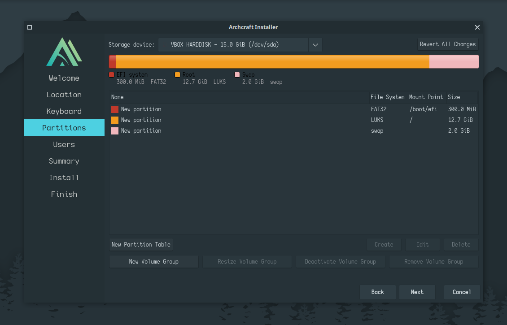

- You may get this message if you choose MBR partition Table on BIOS; Basically the installer wants you to use GPT on BIOS. Just ignore it and click on Ok

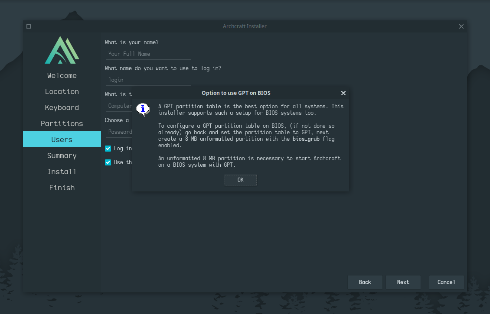

You also may get this warning, if you use encryption and do not encrypt /boot partition. You can also ignore that or you can go back and encrypt your boot partition as well.

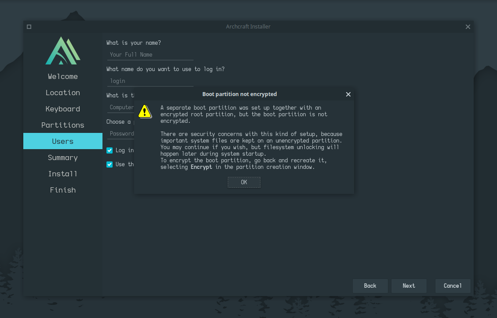

- Now, Enter your *Name, username, hostname* and *password* and click on Next

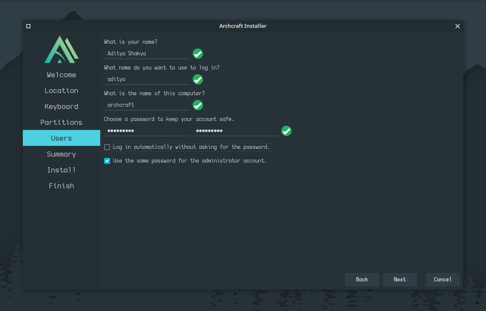

- That's the summary of this installation, Basically everything you did in the installer, Have a good look and then click on Install

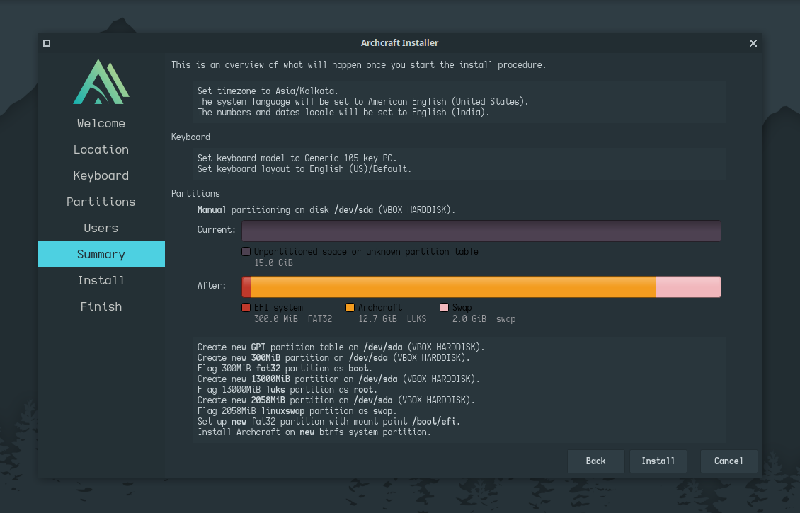

- Now, The actual installation begins. The installer will create partitions, mount them, unpack rootfs, configure locale, generate initrd etc.

And if connected to the internet, it'll download the package databases then configure the installed system and perform clean up.

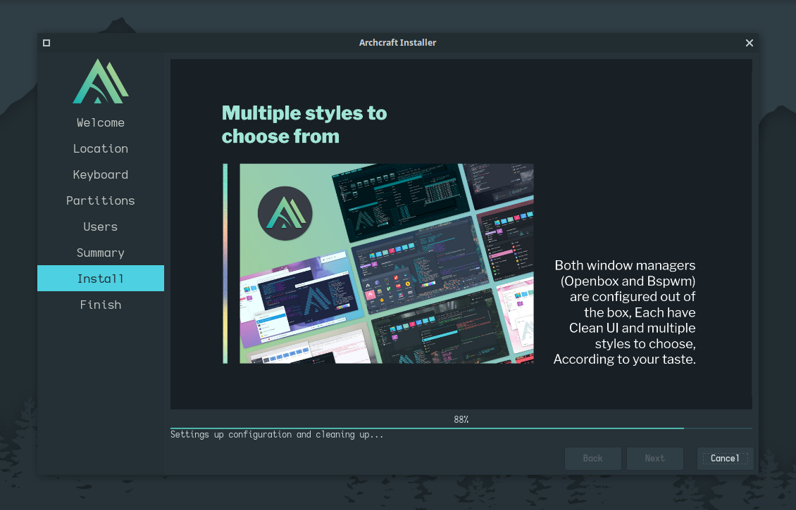

- After successful installation, You can check Restart now and click on Done to reboot your system.

That's it! Archcraft is installed on your system. Reboot the machine &amp; enjoy your new OS.
{: .fs-6 .fw-300 }
