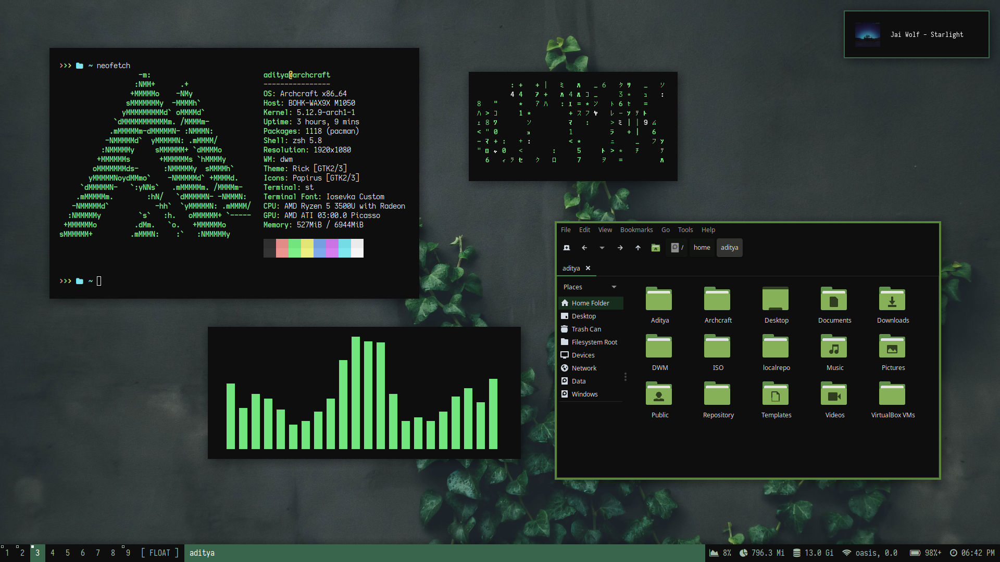

# Install DWM (Dynamic Window Manager) on Archcraft
{: .no_toc }

<details open markdown="block">
  <summary>
    Table of contents
  </summary>
  {: .text-delta }
1. TOC
{:toc}
</details>

Dwm is a dynamic window manager for X. It manages windows in tiled, monocle and floating layouts. All of the layouts can be applied dynamically, optimising the environment for the application in use and the task performed.

Thing is : Dwm is smaller, faster and simpler. And we'll keep it that way. That's the motto of Archcraft. 



Pretty Simple, Hann? Let's install it on our Archcraft. 

## Installation

Open the Terminal and run...

```bash
$ sudo pacman -Syyu
$ sudo pacman -S archcraft-dwm
```

That's it! Yeah... DWM is installed on your Archcraft. Logout & login to DWM, You'll see something like that...


## Key Bindings

The <span class="label label-green">SUPER</span> or <span class="label label-green">WINDOWS</span> key is the default **Modkey**. Few important keybindings only, Rest are the same as default.


|Key|Action|
|:--|:--|
|<span class="btn btn-purple">W + [1..9]</span>|Switch To Desktop 1,2...9|
|<span class="btn btn-purple">W + P</span>|Open App Launcher (Default is dmenu)|
|<span class="btn btn-purple">W + Return</span>|Open Suckless Terminal (st)|
|<span class="btn btn-purple">W + N</span>|Open Network Menu (networkmanager_dmenu)|
|<span class="btn btn-purple">W + X</span>|Open Powermenu (Rofi)|
|<span class="btn btn-purple">W + C</span>|Kill The Client Window|
|<span class="btn btn-purple">W + SHIFT + Return</span>|Open Alacritty Terminal (dwm-terminal)|
|<span class="btn btn-purple">W + SHIFT + F</span>|Open File Manager (dwm-file-manager)|
|<span class="btn btn-purple">W + SHIFT + E</span>|Open Text Editor (dwm-text-editor)|
|<span class="btn btn-purple">W + SHIFT + L</span>|Run Lock Screen Program (dwm-lock)|
|<span class="btn btn-purple">W + SHIFT + R</span>|Reload / Restart DWM|
|<span class="btn btn-purple">W + SHIFT + Q</span>|Quit DWM Directly|
|<span class="btn btn-purple">W + SHIFT + Mouse_1</span>|Resize Floating Client Window with Left Button of Mouse|

## Customization

### Startup Programs
Edit /usr/bin/start_dwm script as root with your favorite text editor and add your startup programs under this section (Make sure you add an '&' symbol at the end of the command or you'll not be able to login into DWM ) :

```bash
## Add your autostart programs here --------------

## -----------------------------------------------
```

### Status Monitor
We have two types of status monitors, Icons and Text, both present in /usr/share/archcraft-dwm/bin/ directory as slstatus_icons and slstatus_text. To change between them, edit the same file above, and change this section :

```bash
## Launch DWM status
exec /usr/share/archcraft-dwm/bin/slstatus_icons &
```


### Rofi Menu
By default, dmenu is used as App launcher. To use rofi instead, Edit <span class="text-blue-100">/usr/share/archcraft-dwm/bin/dwm-menu</span> script.


### Applications
To launch applications of your choice with keybindings, Edit the scripts in <span class="text-blue-100">/usr/share/archcraft-dwm/bin</span> accordingly.

```bash
dwm-file-manager
dwm-lock
dwm-terminal
dwm-text-editor
```

### Themes
No theme settings are supplied in the package, You manually have to apply gtk and icon theme with **lxappearance**. I'm using <span class="text-blue-100">Rick</span> gtk theme (already installed on Archcraft) and <span class="text-blue-100">Papirus</span> icon theme in this setup. Use <span class="text-green-200">papirus-folders</span> program to change folder colors to green or teal, whatever you prefer.

That's it for now, Enjoy DWM in Archcraft.
{: .fs-6 .fw-300 }
